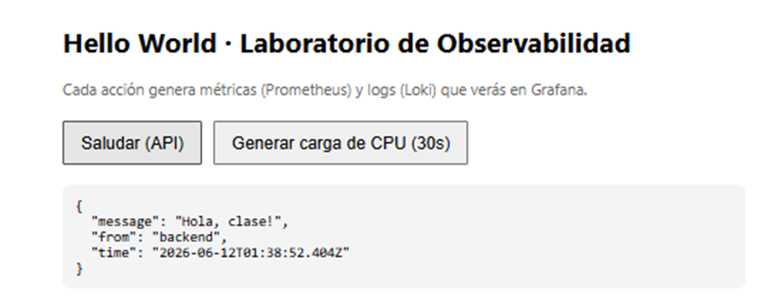

# Monitoreo

En este laboratorio exploraremos monitoreo con herramientas disponibles


## Aplicaciones
```bash
docker compose up -d --build
```

## Servicios y URLs
| Servicio       | URL                         | Notas                                  |
|----------------|-----------------------------|----------------------------------------|
| Frontend       | http://localhost:8080       | Hello World + botones de tráfico/carga |
| Backend (API)  | http://localhost:3001       | `/api/hello`, `/metrics`, `/load`      |
| Grafana        | http://localhost:3000       | admin / admin                          |
| Prometheus     | http://localhost:9090       | datasource ya provisionado             |
| Loki           | http://localhost:3100       | datasource ya provisionado             |
| Alloy (UI)     | http://localhost:12345      | estado del recolector de logs          |
| cAdvisor       | http://localhost:8081       | métricas por contenedor                |
| node-exporter  | http://localhost:9100/metrics | métricas del host                    |

## Configuraciones
- **Datasources** Prometheus y Loki (provisionados automáticamente).
- Logs etiquetados por Alloy con `tier=application` o `tier=infrastructure`.

## Actividad
- El **dashboard** (paneles de CPU + logs de app e infra).
- La **alarma** de CPU > 50%.

## Reset
```bash
docker compose down -v   # borra también dashboards/alarmas creados
```

> Nota de versiones: el tag `prom/prometheus:latest` apunta aún a la rama 2.x (LTS),
> por eso fijamos `v3.8.1`. Promtail EOL (2026-03-02); el recolector de logs
> es Grafana Alloy.
---
# GUIA README
## PASO 0: Yo tengo la IP para grafana 3000:3000 ocupada por el hecho de que estaba practicando días antes y salía ocupada buscando solo hice ese cambio en el docker-compose.yml a 3002:3000.
```bash
  # ----------------------------- Visualización -----------------------------
  grafana:
    image: grafana/grafana:12.4.0
    container_name: lab-grafana
    environment:
      - GF_SECURITY_ADMIN_USER=admin
      - GF_SECURITY_ADMIN_PASSWORD=admin
      - GF_USERS_DEFAULT_THEME=light
    volumes:
      - ./grafana/provisioning:/etc/grafana/provisioning:ro
      - grafana-data:/var/lib/grafana
    ports:
      - "3002:3000"
    depends_on:
      - prometheus
      - loki
    restart: unless-stopped

volumes:
  prometheus-data:
  grafana-data:
```
## Paso 01: Levantar el Stack
Desde la carpeta del proyecto:
- Para levantar el stack:
```bash
docker compose up -d --build
```
- Para comprobar que ya esta levantado.
```bash
docker compose ps
```
Comprueba en el navegador que responden los servicios principales:

| Servicio   | URL                       |
|------------|---------------------------|
| Frontend   | http://localhost:8080     |
| Backend    | http://localhost:3001/metrics |
| Grafana    | http://localhost:3000     |
| Prometheus | http://localhost:9090     |

## Paso 02 — Generar tráfico y logs
Para tener datos que observar:
1.	Abre el frontend en http://localhost:8080.
2.	Pulsa varias veces el botón "Saludar (API)". Cada pulsación genera una petición al backend, una métrica y varias líneas de log.

3.	Deja la pestaña abierta unos minutos: las apps también emiten logs simulados de actividad (pedidos, pagos, advertencias y errores) de forma periódica.

## Paso 03 — Verificar las fuentes de datos en Grafana

---
# Preguntas
## 1. ¿Por qué necesitamos Loki además de Prometheus si ya tenemos /metrics?
- Prometheus: Solo mide números, te dice qué pasa (ej. la CPU subió a 50%).
- Loki: Almacena texto (logs), Te dice por qué pasa (ej. muestra el mensaje de error o la excepción exacta en el código).
## 2. ¿Qué ventaja aporta que las fuentes de datos de Grafana estén aprovisionadas como código y no creadas a mano?
- Automatización: Todo se conecta solo al ejecutar docker compose up sin dar clics manuales.
- Consistencia: El entorno corre exactamente igual en tu máquina o en la del profesor, evitando errores humanos.
- Control de versiones: Cualquier cambio en la infraestructura queda registrado y respaldado en el historial de Git.
## 3. El panel "CPU contenedor" y el panel "CPU host" pueden mostrar valores muy distintos. ¿Por qué? ¿Cuál usarías para alertar sobre una aplicación concreta?
- Porque El Host mide el consumo de toda tu PC, mientras que el Contenedor mide solo tu API de Node.js.
- Se usa la CPU del Contenedor. Si usaras la del Host, la alarma se dispararía por error si abres un juego o muchas pestañas en el navegador.
## 4. ¿Qué diferencia hay entre el evaluation interval y el pending period de una alarma?
- Evaluation Interval: Cada cuánto tiempo Grafana revisa la métrica (ej. revisar cada 10 segundos).
- Pending Period: Tiempo que debe mantenerse la falla para disparar la alarma (ej. esperar 30 segundos estables). Evita falsas alarmas por picos de CPU momentáneos.